# Application Architecture Flow Diagram

This document contains a text-based representation of the application's architecture using Mermaid syntax. You can view this as a visual diagram by pasting the code block below into a Mermaid-compatible editor, such as the [Mermaid Live Editor](https://mermaid.live) or a supported Markdown viewer (like the one in VS Code with the "Markdown Mermaid" extension).

## Flow Diagram

```mermaid
graph TD
    subgraph "Browser (Client-Side)"
        User[👤 User] -->|1. Enters question & clicks 'Ask AI'| AssistPage(📄 IDMC Assist Page);
        AssistPage -->|2. Form submission| ServerActionCall(📞 Calls 'askIdmcQuestion' Server Action);
    end

    subgraph "Server-Side (Next.js & Genkit)"
        ServerActionCall -->|3. Invokes| GenkitFlow(⚡ Genkit Flow: askIdmcQuestionFlow);
        GenkitFlow -->|4. Configures prompt & model| GenkitAI(🤖 Genkit AI Instance);
    end

    subgraph "External AI Service"
        GenkitAI -->|5. Sends API request| AIModel[🧠 Google Gemini API];
        AIModel -->|6. Returns response| GenkitAI;
    end

    subgraph "Server-Side (Next.js & Genkit)"
        GenkitAI -->|7. Sends result back| GenkitFlow;
        GenkitFlow -->|8. Returns result| ServerActionCall;
    end

    subgraph "Browser (Client-Side)"
        ServerActionCall -->|9. Receives answer| AssistPage;
        AssistPage -->|10. Updates UI state| DisplayAnswer[✅ Displays Answer on Page];
        DisplayAnswer --> User;
    end

    style User fill:#f9f,stroke:#333,stroke-width:2px
    style GenkitFlow fill:#ccf,stroke:#333,stroke-width:2px
    style AIModel fill:#9f9,stroke:#333,stroke-width:2px
```

## Component Breakdown

-   **User (👤):** The person interacting with the application.
-   **IDMC Assist Page (📄):** The main React component (`idmc-assist-page.tsx`) that the user sees and interacts with. It's a "Client Component".
-   **Server Action Call (📞):** A feature of Next.js that allows the client-side component to securely call a function on the server.
-   **Genkit Flow (⚡):** The server-side logic (`answer-idmc-question.ts`) that orchestrates the AI request. It receives the input, processes it, and calls the AI model.
-   **Genkit AI Instance (🤖):** The configured Genkit object (`genkit.ts`) that knows how to talk to different AI providers.
-   **Google Gemini API (🧠):** The external AI model that generates the answer.
-   **Displays Answer (✅):** The final step where the UI is updated with the response from the AI.
